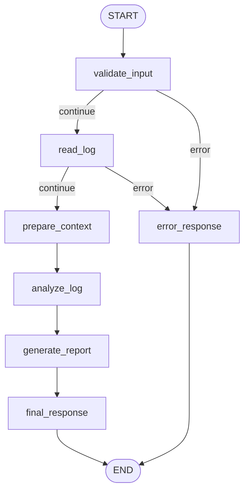

# Arquitetura do LogFlow Agent

## Visão geral

O LogFlow Agent é um agente local em Python 3.12 organizado como um grafo
LangGraph. Cada nó executa uma etapa pequena da análise de logs: validação,
leitura, preparação segura do contexto, análise, geração do relatório e resposta
final.

Além da CLI, o projeto possui uma API FastAPI opcional em `src/api/`. Essa API
atua como adaptador HTTP: recebe upload de arquivo, salva temporariamente em
local controlado e chama o mesmo `build_graph()` usado pela CLI.

O projeto evita chamadas externas e dependências adicionais. A análise é feita
com funções determinísticas para manter o comportamento simples, testável e
adequado ao mini-projeto.

## Fluxo

## Estado compartilhado

O estado do grafo é definido por `LogAnalysisState` em `src/agent/state.py`.
Ele é um `TypedDict` com campos opcionais para:

- caminhos de entrada e saída;
- conteúdo bruto e sanitizado do log;
- erros de validação;
- erros e avisos detectados;
- severidade, resumo e recomendação;
- conteúdo e caminho do relatório;
- status da execução.

## Nós

- `validate_input`: valida se o caminho foi informado, se existe, se é arquivo,
  se a extensão é `.log` ou `.txt` e se o tamanho está dentro do limite.
- `read_log`: lê o arquivo e valida se o conteúdo não está vazio.
- `prepare_context`: aplica mascaramento simples de dados sensíveis.
- `analyze_log`: extrai linhas com erro e aviso, classifica severidade e monta
  resumo e recomendação.
- `generate_report`: grava `outputs/logflow-report.md` ou o caminho informado
  por `--output`.
- `final_response`: marca a execução final como `finished`.
- `error_response`: retorna resumo e recomendação para falhas de validação.

## Conexões condicionais

A função `should_continue_after_validation` verifica `validation_errors`.
Quando há erros, o fluxo segue para `error_response`. Quando não há erros, ele
continua para o próximo nó operacional.

As conexões condicionais são aplicadas após `validate_input` e `read_log`,
porque essas são as etapas que podem interromper a execução por entrada inválida
ou conteúdo vazio.

## Ferramentas integradas

- `src/tools/file_tools.py`: leitura e escrita de arquivos texto em UTF-8.
- `src/tools/log_tools.py`: sanitização, extração de erros e avisos,
  classificação de severidade, resumo e recomendação.
- `src/security/validators.py`: validação de caminho, extensão, tamanho e
  conteúdo mínimo.
- `src/api/main.py`: camada HTTP opcional com `GET /health` e `POST /analyze`.

## Decisões de simplificação

- A análise não usa LLM em tempo de execução, para evitar custo, latência e
  exposição acidental de logs sensíveis.
- O grafo mantém poucos nós e responsabilidades diretas.
- A API não altera o contrato da CLI nem o fluxo principal do LangGraph.
- A severidade usa regras simples: dois ou mais erros são `alta`, um erro é
  `média`, apenas avisos é `baixa` e ausência de achados é `informativa`.
- O relatório é sempre Markdown para facilitar leitura local.
